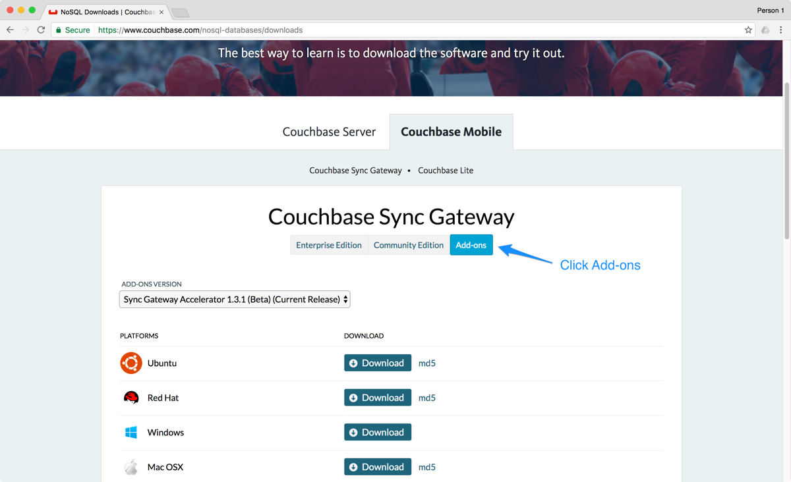

In this guide, you will learn how to scale a Couchbase Mobile deployment with Sync Gateway Accelerator. Before going into the details, it's important to identify if you wish to scale the **read** or **write** throughput of your application's back-end infrastructure.

As a distributed database system, Sync Gateway and Couchbase Server can already be scaled horizontally. Horizontal scaling is achieved by adding more nodes behind a load balancer which distributes the traffic evenly between each one (see the [Install, Upgrade, Scale](../../../current/training/deploy/install/index.html) lesson). This method of scaling is particularly well suited for a scenario with a large amount of **read traffic**. On the other hand, it wouldn't suit a scenario where only the **write traffic** increases.

Sync Gateway Accelerator is designed to cover the second aspect of highly scalable server infrastructure for your application, **write traffic**.

## How does it work?

Part of Sync Gateway's role in a Couchbase Mobile deployment is to monitor changes happening in the backing Couchbase Server bucket, apply security filtering (access control) and stream the results to users.


To optimize this process, Sync Gateway maintains an in-memory cache of recent changes in each channel (steps 2 and 3) which is used to serve the `GET/POST /{db}/_changes` requests (step 4). So as write throughput increases, the cache for a particular document is invalidated more frequently and Sync Gateway needs to retrieve the change from Couchbase Server. Each node will end up doing this work to maintain the in-memory cache.

With Couchbase Mobile 1.4, it's now possible to delegate the task of applying security filtering (access control) to a separate component called Sync Gateway Accelerator. This component can also be scaled horizontally and persists the channel index to a different bucket. In this configuration, the Sync Gateway nodes support your applications (Web, Mobile, IoT) as it normally does while Sync Gateway Accelerator handles the channel indexing. Separating the two workloads in distinct entities makes it possible to scale both Sync Gateway and Sync Gateway Accelerator to handle much larger write throughput. The diagram below represents the architecture differences with and without Sync Gateway Accelerator.


## Configuration

The runtime behavior of a Sync Gateway Accelerator node can be specified in the configuration file. The following information must be provided:

  - **Cluster information:** the location of the data bucket used by the Sync Gateway nodes.
  - **Channel index information:** the location of the channel bucket used by the Sync Gateway Accelerator nodes.

The following configuration contains both of these.

```javascript
{
  "log": ["HTTP+"],
  "cluster_config": {
    "server": "http://localhost:8091",
    "bucket": "default",
    "data_dir": "."
  },
  "databases": {
    "app_name": {
      "server": "http://localhost:8091",
      "bucket": "data_bucket",
      "channel_index": {
        "writer": true,
        "server": "http://localhost:8091",
        "bucket": "channel_bucket"
      }
    }
  }
}
```

Let's take a look at each one in more detail.

### Cluster configuration

The `cluster_config` section is required to manage communication between your Sync Gateway Accelerator nodes. The `server` property is your Couchbase Server address, and `bucket` is the name of your data bucket.

|Property|Type|Description an default|
|:-------|:---|:---------------------|
|`server`|`string`|The hostname of the Couchbase Server cluster.|
|`bucket`|`string`|The bucket name where the data is stored (i.e the one specified in the database configuration.)|
|`data_dir`|`string`|Path to the data directory.|
|`heartbeat_interval_seconds`|`string`|TODO.|

### Channel index information

The `channel_index` section specifies your channel bucket connection information. This is the bucket used by Sync Gateway Accelerator to persist the channel index.

|Property|Type|Description and default|
|:-------|:---|:----------------------|
|`writer`|`boolean`|Whether the channel index node can write to the bucket.|
|`server`|`string`|Hostname to the Couchbase Server cluster.|
|`bucket`|`string`|Bucket name for channel indexing. A common name is "channel_index".|

## Example

Prior to installing Sync Gateway Accelerator you must have a running instance of Sync Gateway persisting documents to Couchbase Server. In this guide, we will assume the following components have already been configured.

- A Couchbase Server cluster is up and running with a bucket called "data_bucket". A bucket cannot be renamed so if you already have a bucket with a different name that's ok. You'll have to replace it with your bucket name where applicable in the following steps of this guide.

    

    As you can see on this image, the bucket contains a few thousand documents that were added through the Sync Gateway
    REST API.

- A Sync Gateway instance persisting the documents to the data bucket.

    ```javascript
    {
      "log": ["HTTP+"],
      "databases": {
        "app_name": {
          "server": "http://localhost:8091",
          "bucket": "data_bucket"
        }
      }
    }
    ```

    Again, if you are following this guide with an existing system already running, your configuration may differ slightly.

### Sync Gateway Accelerator

1. Download Sync Gateway Accelerator from the [Couchbase Downloads page](http://www.couchbase.com/nosql-databases/downloads#couchbase-mobile).

    

2. Create a new bucket called "channel_bucket" in the Couchbase Server cluster.

    

3. Next, create a new file called **accel-config.json**. That's where you must specify the location of the channel and data buckets.

    ```javascript
    {
      "log": ["HTTP+"],
      "adminInterface": ":4986",
      "cluster_config":{
        "server":"http://localhost:8091",
        "bucket":"data_bucket",
        "data_dir":"."
      },
      "databases": {
        "app_name": {
          "server": "http://localhost:8091",
          "bucket": "data_bucket",
          "channel_index": {
            "writer": true,
            "server":"http://localhost:8091",
            "bucket":"channel_bucket"
          }
        }
      }
    }
    ```

    The default listening port for Sync Gateway Accelerator is `4985`. Here, you're setting it to `4986` to avoid using a port that conflicts with Sync Gateway.

4. Start the Sync Gateway Accelerator node.

    ```bash
    ~/Downloads/couchbase-sg-accel/bin/sg_accel accel-config.json
    ```

    Notice the document count is now increasing in `channel_bucket` because the channel assignment data is being stored there instead of in `data_bucket`.

    

### Sync Gateway

The Sync Gateway configuration must be updated with the information regarding the location of the channel index.

1. Update your **sync-gateway-config.json** with the following.

    ```javascript
    {
      "log": ["HTTP+"],
      "databases": {
        "app_name": {
          "server": "http://localhost:8091",
          "bucket": "data_bucket",
          "channel_index": {
            "server": "http://localhost:8091",
            "bucket": "channel_bucket"
          }
        }
      }
    }
    ```

2. Restart Sync Gateway with the updated configuration file.

    ```bash
    ~/Downloads/couchbase-sync-gateway/bin/sync_gateway sync-gateway-config.json
    ```