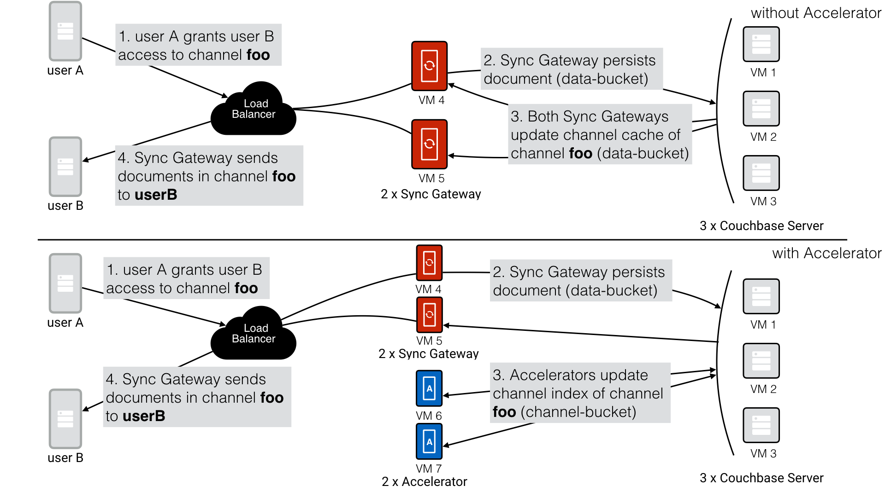

In this guide, you will learn how to scale a Couchbase Mobile deployment with Sync Gateway Accelerator. Before going into the details, it's important to identify if you wish to scale the **read** or **write** throughput of your application's back-end infrastructure.

As a distributed database system, Sync Gateway and Couchbase Server can already be scaled horizontally. Horizontal scaling is achieved by adding more nodes behind a load balancer which distributes the traffic evenly between each one (see the [Install, Upgrade, Scale](../../../current/training/deploy/install/index.html) lesson). This method of scaling is particularly well suited for a scenario with a large amount of **read traffic**. On the other hand, it wouldn't suit a scenario where only the **write traffic** increases.

Sync Gateway Accelerator is designed to cover the second aspect of highly scalable server infrastructure for your application, **write traffic**.

## How does it work?

Part of Sync Gateway's role in a Couchbase Mobile deployment is to query the documents in a given channel from Couchbase Server and stream the results to users.


To optimize this process, Sync Gateway maintains an in-memory cache of recent changes in each channel (step 3) which is used to serve the `GET/POST /{db}/_changes` requests (step 4). So as write throughput increases, the cache for a particular channel is invalidated more frequently and Sync Gateway needs to update its channel cache. Each Sync Gateway instance will end up doing this work to maintain the in-memory cache.

With Couchbase Mobile 1.4, it's now possible to delegate the task of applying security filtering (access control) to a separate component called Sync Gateway Accelerator. This component can also be scaled horizontally and persists the channel index to a different bucket in Couchbase Server. In this configuration, the Sync Gateway nodes support your applications (Web, Mobile, IoT) as normal, while Sync Gateway Accelerator handles the channel indexing. Separating the two workloads in distinct entities makes it possible to scale both Sync Gateway and Sync Gateway Accelerator to handle much larger write throughput. The diagram below represents the architecture differences with and without Sync Gateway Accelerator.



## Example

Prior to installing Sync Gateway Accelerator you must have a running instance of Sync Gateway persisting documents to Couchbase Server. In this guide, we will assume the following components have already been configured, and for simplicity's sake are all running on the same host.

- A Couchbase Server cluster is up and running with a bucket called "data_bucket". A bucket cannot be renamed so if you already have a bucket with a different name that's ok. You'll have to replace it with your bucket name where applicable in the following steps of this section.

    

    As you can see on this image, the bucket contains a few thousand documents that were added through the Sync Gateway
    REST API.

- A Sync Gateway instance persisting the documents to the data bucket with the following configuration file.

    ```javascript
    {
      "log": ["HTTP+"],
      "databases": {
        "app_name": {
          "server": "http://localhost:8091",
          "bucket": "data_bucket"
        }
      }
    }
    ```

    Again, if you are following this guide with an existing system already running, your configuration may differ slightly.

    Note that Sync Gateway Accelerator doesn't provide further scalability to deployments that use bucket shadowing. Bucket shadowing is being deprecated in 1.4 and will be removed in an upcoming version of Couchbase Mobile (2.x).

### Sync Gateway Accelerator

1. Download Sync Gateway Accelerator from the [Couchbase Downloads page](http://www.couchbase.com/nosql-databases/downloads#couchbase-mobile).

    

2. Create a new bucket called "channel_bucket" in the Couchbase Server cluster.

    

    

3. Next, create a new file called **accel-config.json**. That's where you must specify the location of the channel and data buckets.

    ```javascript
    {
      "log": ["HTTP+"],
      "adminInterface": ":4986",
      "cluster_config": {
        "server": "http://localhost:8091",
        "bucket": "data_bucket",
        "data_dir": "."
      },
      "databases": {
        "app_name": {
          "server": "http://localhost:8091",
          "bucket": "data_bucket",
          "channel_index": {
            "writer": true,
            "server": "http://localhost:8091",
            "bucket": "channel_bucket"
          }
        }
      }
    }
    ```

    In the configuration file, there are two points worth noting:
    - The default listening port for Sync Gateway Accelerator is `4985`. Here, you're setting it to `4986` to avoid using a port that conflicts with Sync Gateway.
    - The `"writer": true` property specifies that this Accelerator instance can persist the channel index to the Couchbase Server bucket.

4. Start the Sync Gateway Accelerator node.

    ```bash
    ~/Downloads/couchbase-sg-accel/bin/sg_accel accel-config.json
    ```

    Notice the document count is now increasing in `channel_bucket` because the channel index data is being stored there.

    

    To complete the installation, the Sync Gateway configuration file must be updated to reflect the new location of the channel index (i.e `channel_bucket`).

### Sync Gateway

Follow the steps below to update the Sync Gateway configuration file. It must be updated for every instance that was previously running without Sync Gateway Accelerator.

1. Update your **sync-gateway-config.json** with the following.

    ```javascript
    {
      "log": ["HTTP+"],
      "cluster_config": {
        "server": "http://localhost:8091",
        "data_dir": ".",
        "bucket": "data_bucket"
      },
      "databases": {
        "app_name": {
          "server": "http://localhost:8091",
          "bucket": "data_bucket",
          "channel_index": {
            "server": "http://localhost:8091",
            "bucket": "channel_bucket",
            "writer": false
          }
        }
      }
    }
    ```

    Here, the `"writer": false` property specifies that this Sync Gateway instance doesn't persist the channel index to the Couchbase Server bucket - this task is already performed by the Accelerator instance. 

2. Restart Sync Gateway with the updated configuration file.

    ```bash
    ~/Downloads/couchbase-sync-gateway/bin/sync_gateway sync-gateway-config.json
    ```

The installation of Sync Gateway with Accelerator is now complete. Couchbase Lite clients can continue replicating to the same endpoint as if nothing changed.
