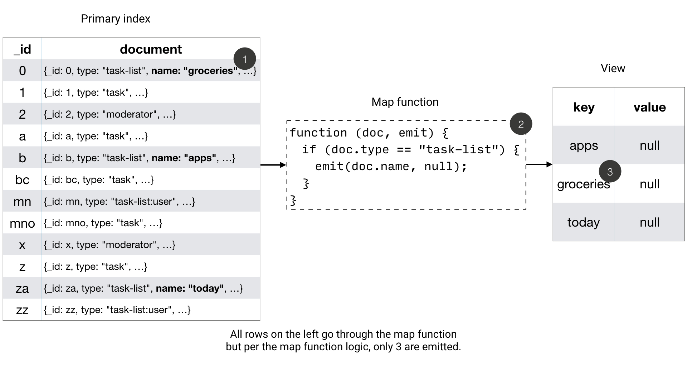
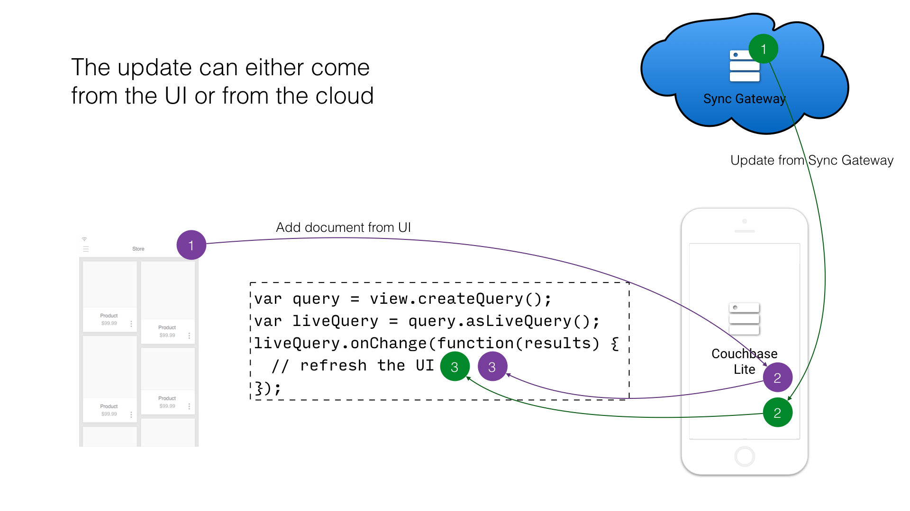

# Using the Database

To save us time coding the user interface for the application, download the starter project below.

<div class="buttons-unit downloads">
  <a href="http://cl.ly/1u2x0A0s3v0q/part1_start.zip" class="button">
    Download starter project
  </a>
</div>

Build & run. You can navigate through the app but nothing gets persisted.

[Download Couchbase Lite for iOS](http://www.couchbase.com/nosql-databases/downloads#couchbase-mobile). Unzip the file and drag **CouchbaseLite.framework** to the **Frameworks** folder in Finder.

Since Couchbase Lite runs on the device, you can bundle a pre-built database in your application. For example, if your app needs to sync a lot of data initially, but that data is fairly static and won't change much, it can be a lot more efficient to bundle a database in your application and install it on the first launch. Of course, this is optional and in most cases, apps start with an empty Couchbase Lite database where data is added by the user or through synchronization with Sync Gateway. There is no limit to how many databases can be created or opened on the device. You can think of a database as a namespace for documents and several databases can be used in the same app (one database per user of the app is a common pattern). A database is stored in the application directory and is only accessible from this application.

In this tutorial, you will use a prebuilt database that contains a grocery list. Download the canned database from the link below and follow the instructions.

[Download the pre-built database](http://cl.ly/1B3R0f360y3L/todo.cblite2.zip)

_
iOS:
Unzip the file.
Drag todo.cblite2 to the Copy Bundle Resources on the Build Phases tab in Xcode.


Open AppDelegate.swift and locate the applicationDidFinishLaunchingWithOptions method.
This method is called by the OS when the application starts but it’s missing the code to use the pre-built database.
Complete it with the following under the // missing code comment.

```swift
let manager = CBLManager.sharedInstance()
do {
    try database = manager.existingDatabaseNamed("todo")
} catch let error as NSError {
    NSLog("Error %@", error)
}
if database == nil {
    let cannedDBPath = NSBundle.mainBundle().pathForResource("todo", ofType: "cblite2")
    do {
        try CBLManager.sharedInstance().replaceDatabaseNamed("todo", withDatabaseDir: cannedDBPath!)
    } catch let error as NSError {
        NSLog("Cannot replace the database %@", error)
    }
}
```

With a database now in your application you can open it. Add the following just below the previous code segment in applicationDidFinishLaunchingWithOptions.

```swift
do {
    try database = CBLManager.sharedInstance().databaseNamed("todo")
} catch let error as NSError {
    NSLog("Cannot open the database: %@", error)
    return false
}
```

_

## Querying Data

With the database in place you are now ready to start coding. The way to query data in Couchbase Lite is by registering a **View** and then running a **Query** on it with **QueryOptions**.

What is a **View** exactly?

A **View** is a persistent index of documents in a database, which you then query to find data. The main component of a View is its map function. It takes a document’s JSON as input, and emits (outputs) any number of key/value pairs to be indexed. First, you will define the view to index the documents of type **task-list**. The diagram below shows the result of that map function.



So you can remember that a view index is a list of key/value pairs, sorted by key. In your application, the view’s logic is written in the native language of the platform you’re developing on.

_
Open **TaskListsViewController.swift** and locate the **setupViewAndQuery** method.
This method is called in **viewDidLoad** but its body is empty at the moment.
Complete it with the following.

```swift
let listsView = database.viewNamed("list/listsByName")
if listsView.mapBlock == nil {
    listsView.setMapBlock({ (doc, emit) in
        if let type: String = doc["type"] as? String, name = doc["name"]
            where type == "task-list" {
                emit(name, nil)
        }
    }, version: "1.0")
}
```
_

The **viewNamed** method returns a [View](http://developer.couchbase.com/documentation/mobile/1.2/develop/guides/couchbase-lite/native-api/view/index.html) object. Here, the view’s map function is indexing documents where the type property is equal to task-list. Every time you call the **emit** function in the map function, a row with that key (name) and value (nil in this case) is added to the index. Each cell on the screen will contain a list name and nothing else. For that reason, you can emit the name property as the key and nil is the value.

With the **View** defined you are now ready to run the **Query**.

_
In **setupViewAndQuery** add the following below the previous code snippet.

```swift
listsLiveQuery = listsView.createQuery().asLiveQuery()
listsLiveQuery.addObserver(self, forKeyPath: "rows", options: .New, context: nil)
listsLiveQuery.start()
```
_

The `listsView.createQuery()` method returns a **Query** object which has a **run** method to return the results as a **QueryEnumerator** object. However, in this case, you are hooking into a **Live Query** to keep monitoring the database for new results. Any time the result of that query changes through user interaction or synchronization, it will notify your application via the change event. A **Live Query** provides an easy way to build reactive UIs, which will be especially useful when you enable sync in Lesson 2. The change event is triggered as a result of user interaction locally as well as during synchronization with Sync Gateway.



The notifications are posted to the application code using the idiomatic APIs on each platform (KVO, change event, callback).

_
Call the reloadTaskLists from the observeValueForKeyPath method which will reload the Table View’s data source.

```swift
override func observeValueForKeyPath(keyPath: String?, ofObject object: AnyObject?,
                                     change: [String : AnyObject]?, context: UnsafeMutablePointer<Void>) {
    reloadTaskLists()
}
```
_

Build and run.


The code to display the tasks is already added to the starter project. You can therefore see the items in the Groceries list.


## Writing Data

Notice that the navigation bar already has a button that prompts the user to enter a name for a new task list.


_
The method **createTaskList** is called when the user clicks the OK button passing the text input value.
In **TaskListsViewController.swift**, add the following in the **createTaskList** method.

```swift
let properties = [
    "type": "task-list",
    "name": name
]
let doc = database.createDocument()
do {
    return try doc.putProperties(properties)
} catch let error as NSError {
    Ui.showMessageDialog(onController: self, withTitle: "Error",
        withMessage: "Couldn't save task list", withError: error)
	return nil
}
```

The **createDocument** method returns a [Document](http://developer.couchbase.com/documentation/mobile/1.2/develop/guides/couchbase-lite/native-api/document/index.html) object type.
The only constraint on the document ID (i.e. the **_id** property in the document’s JSON body) is that it must be unique. You can create a document with a known ID using the **documentWithID** method or let the database generate one for you (using the **createDocument** method), as is the case here.

Build and run. Save a new list to the database and the **Live Query** will pick it up to reload the **UI**.


Swipe to the left on a row to reveal the **Edit** and **Delete** buttons.


The Edit popup prompts the user to enter the new list name.
The **updateTaskList** method in **TaskListsViewController.swift** is called when the user clicks the OK button passing the text input value.
Fill in the missing code in **updateTaskList** with the following.

```swift
func updateTaskList(list: CBLDocument, withName name: String) {
    do {
        try list.update { newRev in
            newRev["name"] = name
            return true
        }
    } catch let error as NSError {
        Ui.showMessageDialog(onController: self, withTitle: "Error",
            withMessage: "Couldn't update task list", withError: error)
    }
}
```
_

The update method takes a callback function or block (the details vary by language). It loads the current revision's properties, then calls this function, passing it an UnsavedRevision object, whose properties are a mutable copy of the current ones. Your callback code can modify this object's properties as it sees fit; after it returns, the modified revision is saved and becomes the current one.

_
The **deleteTaskList** method in **TaskListsViewController.swift** is called when the user clicks the **Delete** action.
Add the following in **deleteTaskList**.

```swift
do {
    try list.deleteDocument()
} catch let error as NSError {
    Ui.showMessageDialog(onController: self, withTitle: "Error",
        withMessage: "Couldn't delete task list", withError: error)
}
```

Build and run.

Well done! You can now create, edit and delete lists.

## Aggregating Data

A problem in typical applications is how to perform data aggregation. Couchbase Lite lets you run those data queries using the full capabilities of map/reduce. To run aggregation queries on the rows emitted by the map function, you can use the reduce function which is the part of map/reduce that takes several rows from the index and aggregates them together in a single object.

Let’s write a view to query and display the number of uncompleted tasks for each list. A task is marked as completed if its **complete** property is true. You need to define a **map** function which returns the number of uncompleted task documents, **group** them by the list they belong to and **count** the number of rows in each group.


Notice that **groupingLevel = 1** coalesces the rows in the view index by their key.

Grouping is a powerful feature of Couchbase Lite. It is available on a **Query** using the **groupLevel** property, which is a number, and it defaults to 0. It basically takes the entire range of output that the query produces (i.e. the entire range of rows) and it coalesces together adjacent rows with the same key.

The most commonly used reduce functions are Count and Sum:

- Count: A function that counts the number of documents contained in the map (used on the diagram above).
- Sum: A function that adds all of the items contained in the map.

_
Open **TaskListsViewController.swift** and locate the **setupViewAndQuery** method you already updated in the previous step.
Add the follow below the existing code.

```swift
let incompTasksCountView = database.viewNamed("list/incompleteTasksCount")
if incompTasksCountView.mapBlock == nil {
    incompTasksCountView.setMapBlock({ (doc, emit) in
        if let type: String = doc["type"] as? String where type == "task" {
            if let list = doc["taskList"] as? [String: AnyObject], listId = list["id"],
                complete = doc["complete"] as? Bool where !complete {
                emit(listId, nil)
            }
        }
        }, reduceBlock: { (keys, values, reredeuce) in
            return values.count
        }, version: "1.0")
}
incompTasksCountsLiveQuery = incompTasksCountView.createQuery().asLiveQuery()
incompTasksCountsLiveQuery.groupLevel = 1
incompTasksCountsLiveQuery.addObserver(self, forKeyPath: "rows", options: .New, context: nil)
incompTasksCountsLiveQuery.start()
```
_

This time, you call emit only if the **document type is task** and **complete is false**. The document ID of the list it belongs to (**doc.taskList._id**) serves as the key and the value is nil. The reduce function simply counts the number of rows with the same key. Notice that the **groupLevel** is a property on the live query object.

Similarly to the previous query, you need to register for live query updates.

Update the body of the **observeValueForKeyPath** method.

```swift
if object as? NSObject == listsLiveQuery {
    reloadTaskLists()
} else if object as? NSObject == incompTasksCountsLiveQuery {
    reloadIncompleteTasksCounts()
}
```

Build and run. You should now see the uncompleted task count for each list.


<div class="buttons-unit downloads">
  <a href="http://cl.ly/0F163Q2k0e1m/part1_final.zip" class="button">
    Download final project
  </a>
</div>
