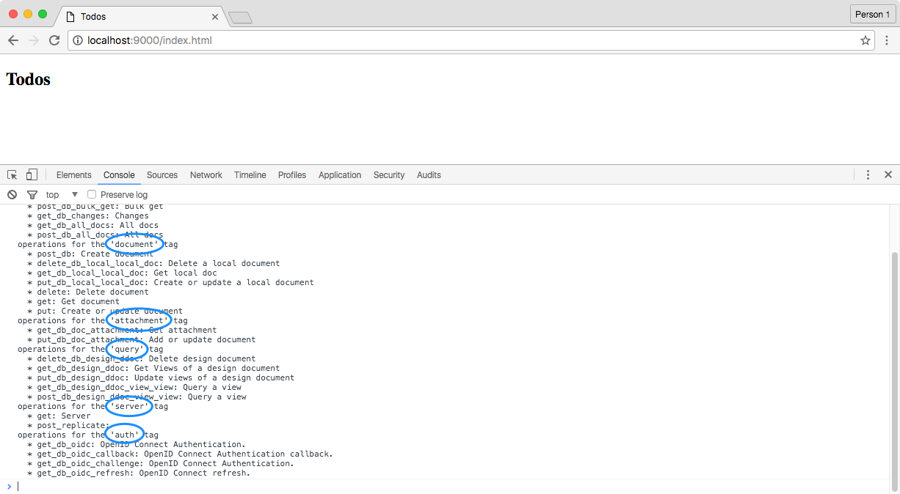
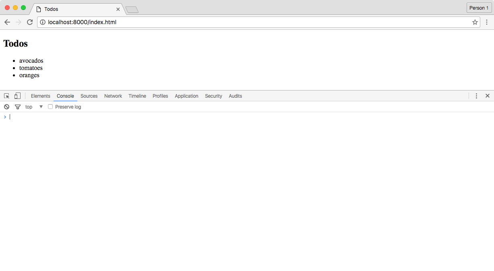

Whether you're developing a web application getting data from the Sync Gateway API or a cross-platform application that uses the Couchbase Lite Listener you will almost certainly need an HTTP library to consume those REST APIs. The documentation for the Couchbase Lite and Sync Gateway REST API is using Swagger. In addition to being a great toolkit for writing REST API documentation, Swagger can also generate HTTP libraries. This guide will walk you through how to start using those libraries in the following scenarios:

- Web development: to display documents stored in Sync Gateway on a web page
- Server-side development: to allow user sign up via an App Server
- Hybrid development: to consume and persist data to Couchbase Lite using the Listener component

The first and second sections will use the same Sync Gateway instance seeded with a few documents. Before getting started, you must have Sync Gateway up and running.

1. [Download Sync Gateway](http://www.couchbase.com/nosql-databases/downloads#couchbase-mobile)
2. In a new working directory, open a new file called `sync-gateway-config.json` with the following

  ```javascript
  {
    "log": ["HTTP+"],
    "CORS": {
      "origin":["http://localhost:8000"],
      "loginOrigin":["http://localhost:8000"],
      "headers":["Content-Type"],
      "maxAge": 1728000
    },
    "databases": {
      "todo": {
        "server": "walrus:",
        "users": { "GUEST": {"disabled": false, "admin_channels": ["*"] } }
      }
    }
  }
  ```
  Here, you're enabling CORS on `http://localhost:8000`, the hostname of the web server that will serve the web application.
3. Start Sync Gateway from the command line with the configuration file

  ```bash
  ~/Downloads/couchbase-sync-gateway/bin/sync_gateway sync-gateway-config.json
  ```
4. Insert a few documents using the POST `/{db}/_bulk_docs` endpoint

  ```bash
  curl -X POST http://localhost:4985/todo/_bulk_docs \
        -H "Content-Type: application/json" \
        -d '{"docs": [{"task": "avocados", "type": "task"}, {"task": "oranges", "type": "task"}, {"task": "tomatoes", "type": "task"}]}'
  ```

## A Simple Web Application

In this section you will use Swagger JS in the browser to insert a few documents and display them in a list. Create a new file called **index.html**  with the following.

```html
<!DOCTYPE html>
<html lang="en">
<head>
  <meta charset="UTF-8">
  <title>Todos</title>
</head>
<body>
  <h2>Todos</h2>
  <ul id="list"></ul>
</body>
<script src="swagger-client.min.js"></script>
<script src="index.js"></script>
</html>
```

Next, create a new file called **index.js** with the following.

```javascript
// initialize swagger client, point to a swagger spec
window.client = new SwaggerClient({
  url: 'http://developer.couchbase.com/mobile/swagger/sync-gateway-public/spec.json',
  usePromise: true
})
  .then(function (client) {
    client.help();
  });
```

Here you're initializing the Swagger library with the Sync Gateway public REST API spec and promises enabled. Promises are great because you can chain HTTP operations in a readable style.

In this working directory, start a web server with the command `python -m SimpleHTTPServer 8000` and navigate to [http://localhost:8000/index.html](http://localhost:8000/index.html) in a browser. Open the dev tools to access the console and you should see the list of operations available on the client object.



All the endpoints are grouped by tag. A tag represents a certain functionality of the API (i.e database, query, authentication). The `client.help()` method is a helper function that prints all the tags available. In this case we'd like to query all documents in the database. We'll use the `get_db_all_docs` method on the database tag to perform this operation. The helper function is available on any node of the API, so you can write `client.database.get_db_all_docs.help()` to print the documentation for that endpoint.


Copy the following below the existing code to query all the documents in the database and display them in the list.

```javascript
client.query.get_db_all_docs({db: 'todo', include_docs: true})
  .then(function (res) {
    var rows = res.obj.rows;
    var list = document.getElementById('list');
    for (var i = 0; i < rows.length; i++) {
      var item = document.createElement('li');
      item.innerText = rows[i].doc.task;
      list.appendChild(item);
    }
  })
  .catch(function (err) {
    console.log(err);
  })
```

The **include_docs** option is used to retrieve the document properties (the text to display on the screen is located on the `doc.task` field). A promise can either be fulfilled with a value (the successful response) or rejected with a reason (the error response). Reload the browser and you should see the list of tasks.



## App Server

You can also use the Admin API spec to perform operations that are only available on the admin port of Sync Gateway. One common operation is to register users. To support sign up in your application, we recommend to have an app server sitting alongside Sync Gateway that performs the user validation, creates a new user on the Sync Gateway admin port and then returns the response to the application.

As this is a server-side component, this example will use the Swagger JS client for Node.js. Install the following dependencies.

```bash
npm install swagger-client express body-parser
```

Open a new file called `app.js` with the following.

```javascript
var Swagger = require('swagger-client')
  , express = require('express')
  , bodyParser = require('body-parser');

var client = new Swagger({
  url: 'http://developer.couchbase.com/mobile/swagger/sync-gateway-admin/spec.json',
  usePromise: true
})
  .then(function (res) {
    client = res;
  });

var app = express();
app.use(bodyParser.json());

app.post('/signup', function (req, res) {
  client.user.post_db_user({db: 'todo', body: {name: req.body.name, password: req.body.password}})
    .then(function (userRes) {
      res.status(userRes);
      res.send(userRes);
    })
    .catch(function (err) {
      res.status(err.status);
      res.send(err);
    });
});

app.listen(3000, function () {
  console.log('App listening at http://localhost:3000');
});
```

Here, you're using the `post_db_user` method to create the user and the Node.js express module to create a route and return the response from Sync Gateway on the admin port. Start the app server from the command line.

```bash
node app.js
```

Create a user using curl.

```bash
curl -H 'Content-Type: application/json' -X POST 'http://localhost:3000/signup' \
     -d '{"name": "john", "password": "pass"}'
```

You can now send this request from your mobile and web clients and display a message according to the response status:
- `201`: The user was successfully created
- `409`: A user with this name already exists

## Hybrid Development

The Couchbase Lite Listener exposes the same functionality as the native SDKs through a common RESTful API. You can perform the same operations on the database by sending HTTP requests to it.

The Swagger JS client allows us to leverage the Couchbase Lite REST API Swagger spec in hybrid mobile frameworks such as PhoneGap. Follow the [PhoneGap installation page](http://developer.couchbase.com/documentation/mobile/1.3/installation/phonegap/index.html) to create a new project with the Couchbase Lite PhoneGap plugin. Then to install the Swagger JS library run the following:

- [Download the Swagger JS client](https://raw.githubusercontent.com/swagger-api/swagger-js/master/browser/swagger-client.min.js) to a new file **www/js/swagger-client.min.js**.
- [Download the Couchbase Lite Swagger spec](http://developer.couchbase.com/mobile/swagger/couchbase-lite/spec.json) to a new file **www/js/spec.js**. Your IDE might show an error because you've copied a JSON object into a JavaScript file but don't worry, prepend the following to set the spec on the `window` object.

  ```javascript
  window.spec = {
    "swagger": "2.0",
    "info": {
      "title": "Couchbase Lite",
      ...
    }
  }
  ```

Reference both files in **www/index.html** before `app.initialize()` is executed.

```html
<script type="text/javascript" src="js/swagger-client.min.js"></script>
<script type="text/javascript" src="js/spec.js"></script>
<script type="text/javascript">
    app.initialize();
</script>
```

Then, open **www/js/index.js** and add the following in the `onDeviceReady` lifecycle method.

```javascript
var client = new SwaggerClient({
  spec: window.spec,
  usePromise: true,
})
  .then(function (client) {
    client.setHost(url.split('/')[2]);
    client.server.get_all_dbs()
      .then(function (res) {
        var dbs = res.obj;
        if (dbs.indexOf('todo') == -1) {
          return client.database.put_db({db: 'todo'});
        }
        return client.database.get_db({db: 'todo'});
      })
      .then(function (res) {
        return client.document.post({db: 'todo', body: {task: 'Groceries'}});
      })
      .then(function (res) {
        return client.query.get_db_all_docs({db: 'todo'});
      })
      .then(function (res) {
        alert(res.obj.rows.length + ' document(s) in the database');
      })
      .catch(function (err) {
        console.log(err)
      });
  });
```

First you set the host of the Swagger JS client to the url provided in the callback (it is of the form `lite.couchbase.` on iOS and `localhost:5984` on Android). Then, the chain of promises creates the database, inserts a document and displays the total number of documents in an alert window using the `/{db}/_all_docs` endpoint.

Build and run.

```bash
phonegap run ios
phonegap run android
```

You should see the alert dialog displaying the number of documents.


