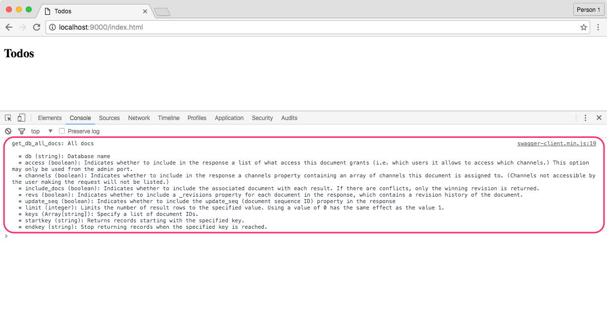

Whether you're developing a web application getting data from the Sync Gateway API or a cross-platform application that uses the Couchbase Lite Listener you will almost certainly need an HTTP library to consume those REST APIs. The documentation for the Couchbase Lite and Sync Gateway REST API is using Swagger. In addition to being a great toolkit for writing REST API documentation, Swagger can also generate HTTP libraries. This guide will walk you through how to start using those libraries in the following scenarios:

- Web development: to display documents stored in Sync Gateway on a web page
- Server-side development: to allow user sign up via an App Server
- Hybrid development: to consume and persist data to Couchbase Lite using the Listener component

The first and second sections will use the same Sync Gateway instance seeded with a few documents. Follow the steps below to get Sync Gateway up and running.

1. [Download Sync Gateway](http://www.couchbase.com/nosql-databases/downloads#couchbase-mobile)
2. In a new working directory, open a new file called `sync-gateway-config.json` with the following

	```javascript
	{
		"log": ["HTTP+"],
		"CORS": {
			"origin":["http://localhost:8000"],
			"loginOrigin":["http://localhost:8000"],
			"headers":["Content-Type"],
			"maxAge": 1728000
		},
		"databases": {
			"todo": {
				"server": "walrus:",
				"users": { "GUEST": {"disabled": false, "admin_channels": ["*"] } }
			}
		}
	}
	```
  
	Here, you're enabling CORS on `http://localhost:8000`, the hostname of the web server that will serve the web application.
  
3. Start Sync Gateway from the command line with the configuration file

	```bash
	~/Downloads/couchbase-sync-gateway/bin/sync_gateway sync-gateway-config.json
	```

4. Insert a few documents using the POST `/{db}/_bulk_docs` endpoint

  ```bash
  curl -X POST http://localhost:4985/todo/_bulk_docs \
        -H "Content-Type: application/json" \
        -d '{"docs": [{"task": "avocados", "type": "task"}, {"task": "oranges", "type": "task"}, {"task": "tomatoes", "type": "task"}]}'
  ```

## A Simple Web Application

In this section you will use Swagger JS in the browser to insert a few documents and display them in a list. Create a new file called **index.html**  with the following.

```html
<!DOCTYPE html>
<html lang="en">
<head>
  <meta charset="UTF-8">
  <title>Todos</title>
</head>
<body>
  <h2>Todos</h2>
  <ul id="list"></ul>
</body>
<script src="swagger-client.min.js"></script>
<script src="index.js"></script>
</html>
```

Download [swagger-client.min.js](https://raw.githubusercontent.com/swagger-api/swagger-js/master/browser/swagger-client.min.js) and place it into your working directory.

Next, create a new file called **index.js** to start sending requests to Sync Gateway.

```javascript
// initialize swagger client, point to a swagger spec
window.client = new SwaggerClient({
  url: 'http://developer.couchbase.com/mobile/swagger/sync-gateway-public/spec.json',
  usePromise: true
})
  .then(function (client) {
    client.help();
  });
```

Here you're initializing the Swagger library with the Sync Gateway public REST API spec and promises enabled. Promises are great because you can chain HTTP operations in a readable style.

> **Note:** Keep in mind that in this example the Swagger client is pointing to the spec hosted on developer.couchbase.com. We often publish changes to those specs for documentation purposes; if it's a breaking change then it will modify the request and parameter names in the Swagger client and break your code. You can refer to the [changelog of the specs](https://github.com/couchbaselabs/couchbase-mobile-portal/blob/master/swagger/CHANGELOG.md) to find the list of methods and parameters that changed. In production, we highly encourage you to download the spec as a `.json` file and pass it to the Swagger client using the `{spec: <spec>}` option.

In this working directory, start a web server with the command `python -m SimpleHTTPServer 8000` and navigate to [http://localhost:8000/index.html](http://localhost:8000/index.html) in a browser. Open the dev tools to access the console and you should see the list of operations available on the `client` object.


All the endpoints are grouped by tag. A tag represents a certain functionality of the API (i.e database, query, authentication).

The `client.help()` method is a helper function that prints all the tags available. In this case we'd like to query all documents in the database so we'll use the `get_db_all_docs` method on the database tag to perform this operation. The helper function is available on any node of the API, so you can write `client.database.get_db_all_docs.help()` to print the documentation for that endpoint as shown below.



Copy the following below the existing code in **index.js** to query all the documents in the database and display them
 in the list.

```javascript
client.query.get_db_all_docs({db: 'todo', include_docs: true})
  .then(function (res) {
    var rows = res.obj.rows;
    var list = document.getElementById('list');
    for (var i = 0; i < rows.length; i++) {
      var item = document.createElement('li');
      item.innerText = rows[i].doc.task;
      list.appendChild(item);
    }
  })
  .catch(function (err) {
    console.log(err);
  })
```

The **include_docs** option is used to retrieve the document properties (the text to display on the screen is located on the `doc.task` field). A promise can either be fulfilled with a value (the successful response) or rejected with a reason (the error response). Reload the browser and you should see the list of tasks.

