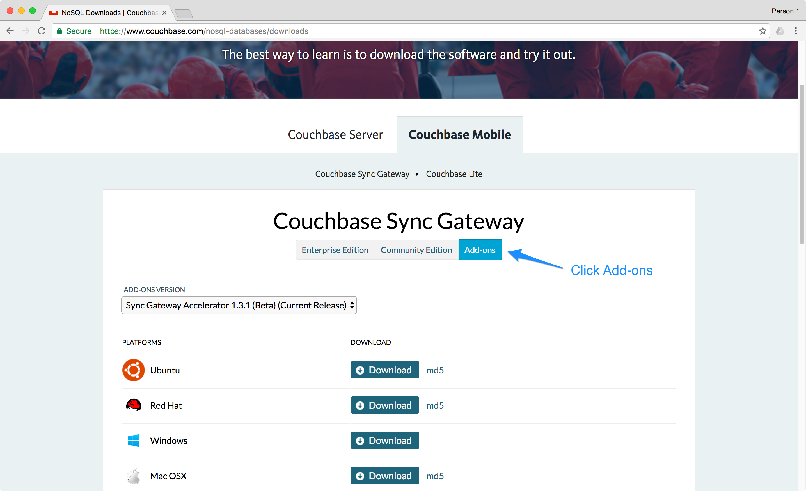

Prior to installing Sync Gateway Accelerator you must have a running instance of Sync Gateway persisting documents to Couchbase Server. In this guide, we will assume the following components have already been configured.

- A Couchbase Server cluster is up and running with a bucket called "data_bucket". A bucket cannot be renamed so if you already have a bucket with a different name that's ok. You'll have to replace it with your bucket name where applicable in the following steps of this guide.

    

    As you can see on this image, the bucket contains a few thousand documents that were added through the Sync Gateway
    REST API.

- A Sync Gateway instance persisting the documents to the data bucket.

    ```javascript
    {
      "log": ["HTTP+"],
      "databases": {
        "app_name": {
          "server": "http://localhost:8091",
          "bucket": "data_bucket"
        }
      }
    }
    ```

    Again, if you are following this guide with an existing system already running, your configuration may differ slightly.

## Installing Sync Gateway Accelerator

1. Download Sync Gateway Accelerator from the [Couchbase Downloads page](http://www.couchbase.com/nosql-databases/downloads#couchbase-mobile).

    

2. Create a new bucket called "channel_bucket" in the Couchbase Server cluster.

    

3. Next, create a new file called **accel-config.json**. That's where you must specify the location of the channel and data buckets.

    ```javascript
    {
      "log": ["HTTP+"],
      "adminInterface": ":4986",
      "cluster_config":{
        "server":"http://localhost:8091",
        "bucket":"data_bucket",
        "data_dir":"."
      },
      "databases": {
        "app_name": {
          "server": "http://localhost:8091",
          "bucket": "data_bucket",
          "channel_index": {
            "writer": true,
            "server":"http://localhost:8091",
            "bucket":"channel_bucket"
          }
        }
      }
    }
    ```

    The default listening port for Sync Gateway Accelerator is `4985`. In this configuration file, you're setting it to `4986` because Sync Gateway also defaults to `4985`.

4. Start the Sync Gateway Accelerator node.

    ```bash
    ~/Downloads/couchbase-sg-accel/bin/sg_accel accel-config.json
    ```

    Notice the document count is now increasing in `channel_bucket` because the channel assignment data is being stored there instead of in `data_bucket`.

    

## Sync Gateway

The Sync Gateway configuration must be updated with the information regarding the location of the channel index.

1. Update your **sync-gateway-config.json** with the following.

    ```javascript
    {
      "log": ["HTTP+"],
      "databases": {
        "app_name": {
          "server": "http://localhost:8091",
          "bucket": "data_bucket",
          "channel_index": {
            "server": "http://localhost:8091",
            "bucket": "channel_bucket"
          }
        }
      }
    }
    ```

2. Restart Sync Gateway with the updated configuration file.

    ```bash
    ~/Downloads/couchbase-sync-gateway/bin/sync_gateway sync-gateway-config.json
    ```