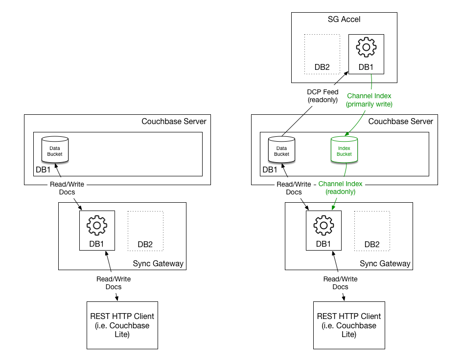

As your user base grows, Sync Gateway and Couchbase Server must handle an increase in throughput. Both components can be scaled horizontally (i.e by adding more nodes) to meet the desired load and lower the time it takes to complete a replication with Couchbase Lite. This is covered in the [Install, Upgrade, Scale](/documentation/mobile/current/training/deploy/install/index.html) lesson in which 2 Sync Gateway nodes are deployed behind a load balancer and then a 3rd node is added to the cluster. This method of scaling is well suited for a scenario with a large amount of **read traffic**. However, there is a limit to how much **write traffic** a standard Sync Gateway cluster can handle.

Sync Gateway needs to monitor changes happening in the backing Couchbase Server bucket, apply security filtering (access control) and stream those changes to users. To optimize this process, Sync Gateway maintains an in-memory cache of recent changes in each channel which is used to serve the `GET/POST \_changes` requests. So as write throughput increases, the cache for a particular document is invalidated more frequently and Sync Gateway needs to retrieve the change from Couchbase Server. Each node will end up doing this work to maintain the in-memory cache.

With Couchbase Mobile 1.4, it's now possible to delegate the task of applying security filtering (access control) to a separate component called Sync Gateway Accelerator. This component can also be scaled horizontally and persists the channel index to a different bucket. In this configuration, the Sync Gateway nodes support your applications (Web, Mobile, IoT) as it normally does while Sync Gateway Accelerator handles the channel indexing. Separating the two workloads in distinct entities makes it possible to scale both Sync Gateway and Sync Gateway Accelerator to handle much larger write throughput. The diagram below represents the architecture differences with and without Sync Gateway Accelerator.

