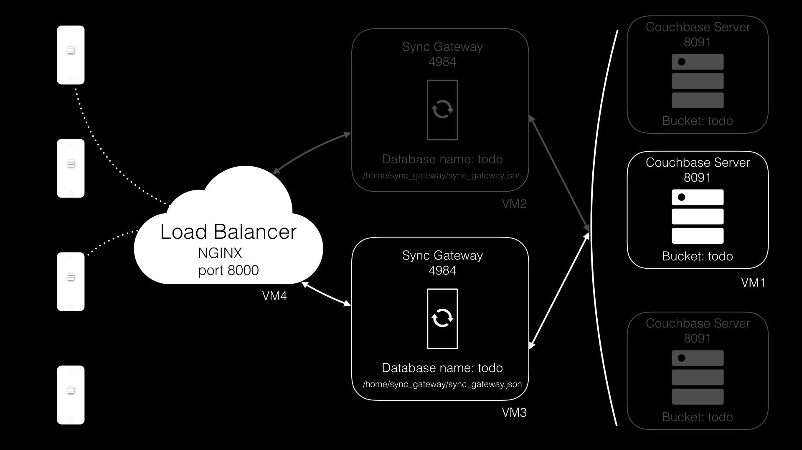
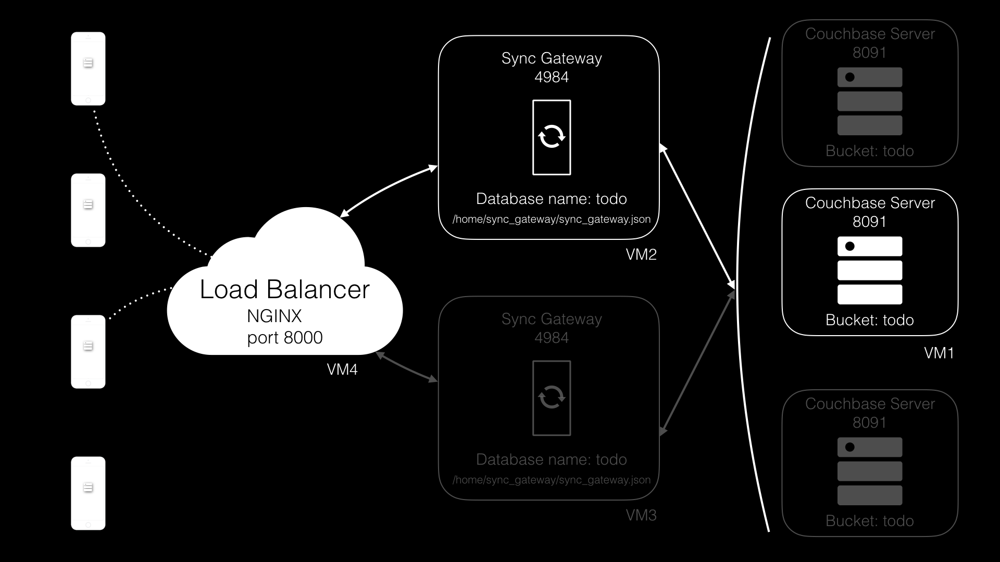

In this lesson you'll learn how to install upgrades for Sync Gateway with zero downtime.

[//]: # "COMMON ACROSS LESSONS"

#### Requirements

Three instances with the following:

- Centos 7
- RAM >= 2GB

#### Getting Started

This lesson contains some scripts to automatically deploy and configure Sync Gateway with Couchbase Server. Download those scripts on each VM using wget.

```bash
ssh vagrant@192.168.34.11
wget https://cl.ly/1q300A3v3R1D/deploy.zip
sudo yum install -y unzip
unzip deploy.zip
```

Throughout this lesson, you will use different scripts located in the **deploy** folder.

[//]: # "COMMON ACROSS LESSONS"

## Architecture

To follow this lesson you must first have completed the Install lesson and have 2 Sync Gateway nodes up and running. You have deployed Sync Gateway 1.3 and in this lesson you will deploy Sync Gateway 1.3.1 as a rolling upgrade.

A rolling upgrade means that the nodes are upgraded one at a time. While a node is being upgraded it's taken offline by rebalancing the traffic to other nodes. The diagram below shows this process.

## Upgrading VM2

First you will need to redirect the traffic to only one Sync Gateway node (VM3). Once the traffic is redirected you will upgrade Sync Gateway on VM2.



### Try it out

1. Log on VM4 (nginx).
1. `cd deploy`
1. Run the NGINX script passing only the IP of VM3.

    ```bash
    sudo ./configure_nginx.sh VM3
    ```

1. Log into VM2 (sync-gateway)
1. Run the Sync Gateway upgrade script on VM2.

    ```bash
    sudo ./upgrade_sync_gateway.sh
    ```
    
1. Change back to VM4
1. Run the NGINX script again this time passing the IP of VM2 and VM3.

    ```bash
    sudo ./configure_nginx.sh VM2 VM3
    ```

1. Monitor the NGINX operations in real-time.

    ```bash
    sudo tail -f /var/log/nginx/access_log
    ```

1. Change back to VM2.
1. Send a server request to the NGINX port. The response contains the Sync Gateway version. Notice it switches between 1.3.0 and 1.3.1 because only one node was upgraded.

    ```bash
    curl 'http://localhost:8000'
    ```

    

## Upgrading VM3

In this section you will perform the same sequence of operations to upgrade Sync Gateway on VM3.



### Try it out

1. Log on VM4 (nginx).
2. Run the NGINX script passing only the IP of VM2.

    ```bash
    sudo ./configure_nginx.sh VM2
    ```

3. Log on VM3 (sync-gateway).
4. Run the Sync Gateway upgrade script on VM3.

    ```bash
    sudo ./upgrade_sync_gateway.sh
    ```

5. Log on VM4 (nginx).
6. Run the NGINX script again this time passing the IP of VM2 and VM3.

    ```bash
    sudo ./configure_nginx.sh VM2 VM3
    ```

7. Verify that the Sync Gateway version is now 1.3.1.

    ```bash
    curl VM4:8000

    {
        "couchdb":"Welcome",
        "vendor":{"name":"Couchbase Sync Gateway","version":1.3},
        "version":"Couchbase Sync Gateway/1.3.1(16;f18e833)"
    }
    ```

<block class="all" />

## Conclusion

Well done! You've completed this lesson on upgrading the Sync Gateway version. In the next lesson you will learn how to scale Sync Gatway by adding additional nodes. Feel free to share your feedback, findings or ask any questions on the forums.
