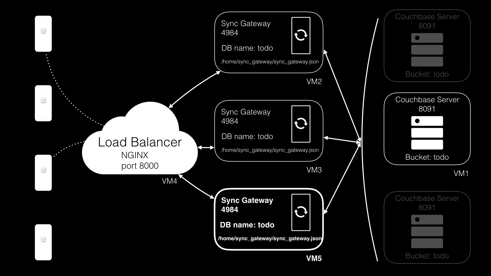

In this lesson you'll learn how to scale Sync Gateway and Couchbase Server in real-time with zero downtime.

#### Requirements

Four instances with the following:

- Ubuntu >= 12.04, =< 14.04
- RAM >= 2GB

## Architecture

In this lesson you will deploy a 3rd Sync Gateway node behind the reverse proxy.



## Scaling Sync Gateway

Similarly to previous lessons you will first deploy Sync Gateway with the configuration file passing the IP of the VM running Couchbase Server. The script below downloads and installs Sync Gateway 1.3.1. Then it restarts the `sync_gateway` service with the configuration file of the todo application.

```bash
#!/usr/bin/env bash

# Download Sync Gateway 1.3
wget http://packages.couchbase.com/releases/couchbase-sync-gateway/1.3.0/couchbase-sync-gateway-enterprise_1.3.0-274_x86_64.deb

# Install Sync Gateway 1.3
dpkg -i couchbase-sync-gateway-enterprise_1.3.0-274_x86_64.deb

# Update Sync Gateway config with Couchbase Server URL
sed 's/walrus:/http:\/\/'${1}':8091/g' sync-gateway-config.json > sync_gateway.json

# Replace the default config file with the one from the app
mv sync_gateway.json /home/sync_gateway/sync_gateway.json

# Restart the sync_gateway service
service sync_gateway restart
```

There are now 3 Sync Gateway nodes but the reverse proxy is forwarding the load to only 2 of them. To balance the traffic across all 3 you must update the NGINX config file with the IP of VM4. The following scripts updates the NGINX configuration file with the IP addesses passed as arguments.

### Try it out

1. Log on the terminal console of VM4.
2. Run the Sync Gateway install script passing the IP of VM4 where Couchbase Server is running.

    ```bash
    bash install_sync_gateway.sh VM1
    ```

3. Log on the terminal console of VM2.
4. Run the NGINX install script passing the IP of VM2, VM3 and VM4 where the Sync Gateway instances are running.

    ```bash
    bash install_nginx.sh VM2 VM3 VM4
    ```

5. Monitor the NGINX operations in real-time.

    ```bash
    tail -f /var/log/nginx/access_log
    ```

6. Send a `/{db}/_all_docs` request with the **user1/password** credentials to http://VM2_IP:8000/todo. The Sync Gateway logs will print this operation.

    

## Conclusion

Well done! You've completed this lesson on scaling. Feel free to share your feedback, findings or ask any questions on the forums.